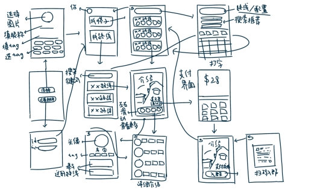
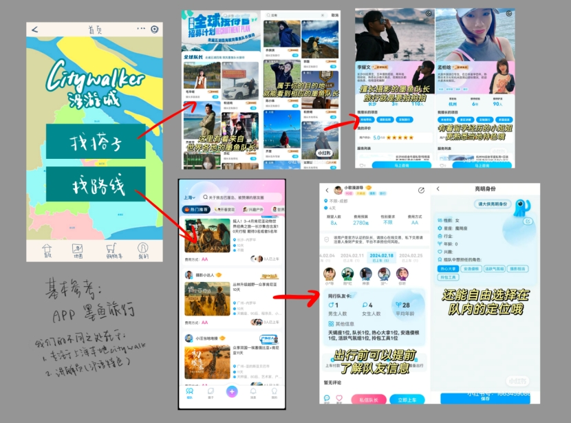

# 漫游城____citywalker社群平台先行者

## 一、申报书部分

| 参赛项目                                                     | 漫游城——citywalker社群平台先行者                             |      |
| ------------------------------------------------------------ | ------------------------------------------------------------ | ---- |
| 组别（勾选）                                                 | £ 科技创新和未来产业   £ 乡村振兴和脱贫攻坚  £ 城市治理和社会服务£ 生态环保和可持续发展  R 文化创意和区域合作 |      |
| **项目简介**（200-500字左右）                                | 随着citywalk的盛行，有不少市民与游客希望能够更多的参与到这种深度了解城市的模式中。目前，市面上已经有了各类citywalk组团成行的活动，但是尚且没有一个平台整合相关信息。本项目旨在通过搭建一个citywalker社群平台解决该痛点，平台基本功能包括：1、搜索。输入关键词（如苏州河、梧桐区等），平台推荐相关路线与citywalk攻略，该功能可以帮助使用者减少规划路线的困扰；2、组队。使用者可以看到正在组团的citywalk活动并进行团购，citywalk活动配备有解说员，该功能帮助有citywalk需求的消费者找到专业领队，能够带着主题更加深入、系统地了解城市或者区域的历史、文化、生活气息；3、社群。在注册该平台时，需要填写如mbti、兴趣爱好、饮食习惯等标签，后续通过该平台的“找搭子”搜索框可以看到他人的标签，从而延展出更多的社交可能性，实现了人与人的连接。同时在互动社区还可以发布帖子、建议、citywalk日记等内容，或者在可编辑的“citywalk活点地图”上标注推荐地点，鼓励市民或游客参与到城市的品牌讲述中来。该平台以微信小程序的方式呈现，。 |      |
| **\*社会价值\**20\*******\*0-500字左右\***、*\*)\            | “漫游城”citywalker社群平台突出了共融、共享的特点，紧密围绕上海地区并进一步延展至长三角地区。该项目有望实现商业与文化的平衡，一方面有助于本地文化的传播和运营方式的突破；另一方面打通城市建筑、人文、商业等垂类社群之间的充分互动，带动更全面的城市经济复兴。具体效果包括：1、文化传播。该平台可以为更多人群提供深入了解城市的内涵和特色的取代，从而增强城市的文化自信和认同感。2、对外交流。本项目设置了多语言的导赏服务，有利于吸引国内外的游客和专业人士为他们提供的城市漫步体验，从而促进城市的对外交流和合作。3、对外经贸。城市漫步平台可以通过提升城市的吸引力和知名度，促进城市的旅游业发展，进而吸引国内外的投资者和创业者、促进城市的对外经贸和产业发展。该平台可以直接带动30余人就业。岗位包括：平台运营、软件开发、后期维护、城市漫步路线讲解员及向导、路线策划人员等。间接带动就业超千人，能够带动相关的餐饮、住宿、交通、购物等行业的就业。 |      |
| ***\*实践过程\*******\*(2\*******\*00-500字左右\*******\*)\**** | 本项目首先通过问卷调查、访谈、观察等方式，了解了citywalk的潜在用户的需求、偏好、期待和满意度，分析citywalk的市场规模、竞争力和发展趋势，评估citywalk的社会效益和影响力。进而深入行业，通过网络搜索、文献阅读、案例分析等方式，了解相关理论、政策、标准和规范，参考国内外的citywalk活动开展与营销的成功案例，探索citywalk社群平台的运营模式和宣传策略。同时，通过实地考察，走访较为火热的citywalk打卡地点，如梧桐区、苏州河等，了解城市漫步的适宜地点、路线和内容，规划10余条路线，打造故事化、体验化和互动化的产品。在平台测试期，与驴屋亲子游等相关企业合作，邀请顾客测试漫游城社群平台的可行性和可操作性，收集用户反馈和数据指标进行优化。该项目还通过培训课程、工作坊、沙龙等方式，培养了能够胜任城市导览的专业人才和志愿者，包括讲解员、向导、策划人员等，建立起citywalk领域的人才队伍和社群网络。 |      |
| ***\*创新意义\*******\*（200\*******\*-500字左右\*******\*）\**** | 尽管citywalk在近年较为火热，但从各层次人群来看，目前在市场上的认知度仍相对较低，并没有像传统的旅游方式被广泛认知和接受。整个赛道处于起步阶段，相对明确的统一的定位和推广策略目前也尚未形成。北京、上海、广州等多个城市也都有本地的citywalk组织，但相关产业大部分都只是个体投资者在经营，并没有形成一定的规模和体系，基本上依赖熟人社群，没有一个整合相关信息的社群平台。而该项目可以很好的解决以上痛点，“找搭子”帮助使用者找到目标需求或兴趣爱好共振的陪伴者，按需拼装出的“临时共同体”既放松自在又碰撞出了延展深度社交关系的可能；“找路线”功能能够让使用者获得个性化、差异化的旅游体验；团购功能解决了很多人其有出游的意愿却不知道该怎么玩，通过提供专业解说员带使用者深度观察、体验、挖掘城市故事；社群功能推动人们主动享用城市空间、分享城市漫步体验、参与城市品牌建设。整体而言，“漫游城”citywalker社群平台的创新成果对于赋能文旅传统产业以及助力形成新产业新业态、新模式有着积极意义。 |      |
| ***\*发展前景\*******\*（200\*******\*-500字左右\*******\*）\**** | 受到疫情和经济下行压力的影响，文旅行业的宏大的旅游叙事被消解，“小众化”和“本地化”的趋势逐渐抬头。citywalk作为一种深度体验该城市的历史、人文、景观等非随意和无目的旅游方式成为了人们的新选择。截至2023年上半年，“citywalk”在小红书的相关搜索量同比增长30倍，市面上亟待出现一个citywalk社群平台帮助citywalk转型为长期消费变现模式，该项目目标定位、市场分析清晰、有前瞻性。同时，该项目在商业模式、营销策略、财务管理、发展战略等方面设计完整、合理、可行。从商业模式来看，“漫游城”citywalker社群平台通过提供城市漫步的相关信息、产品、服务、社区等，连接城市漫步的供需双方，形成一个多方共赢的生态系统。平台通过多种方式实现盈利，包括：广告合作、活动付费、内容付费、异业联盟等。其商业模式具有创新性、灵活性、可扩展性，能够满足不同用户的需求，抓住citywalk的市场机会、前景乐观。从财务管理来看，该平台将采用科学、规范、透明的财务管理，制定合理的预算和报表，控制成本和风险，提高收入和利润，优化资金流和现金流。定期进行财务分析和评估，进行财务决策和优化，进行财务监督和审计，从而能够实现可持续发展。从营销策略来看，平台将利用网络媒体、社交平台、口碑传播等方式，进行线上宣传和推广，打造城市漫步的热点话题和社群氛围。同时开展线下活动、合作伙伴、用户体验等方式，进行线下展示和体验，增加和激活用户，打造品牌形象和用户口碑。还可以根据城市漫步的发展趋势和机遇，进行市场拓展和合作拓展，提高市场占有率和合作伙伴数，提升平台规模和影响力。与当地的艺文机构、商户、博物馆或艺术馆等进行异业合作，推出城市沉浸式体验产品，进一步探索盈利的可能性。 |      |
| ***\*团队协作\*******\*（200-500字左右）\****                | 本项目团队成员来自不同专业，各有分工：传播学院的成员负责项目的策划和宣传，中国语言文学系的成员负责文案的撰写和编辑，设计学院的成员负责平台的设计和美化，软件与工程学院的成员负责平台的开发和搭建。各成员的专业背景均与相关工作内容匹配，负责了项目的不同模块和任务，团队组织架构与分工情况清晰明确。不同的专业背景和知识储备还利于团队从多个角度和层面分析和解决问题。此外，本团队的成员的个人特质与价值观念与该项目相匹配。成员中有4人为上海人，熟悉当地文化与特色。同时，5位成员均为2022级或2023级本科生，对于社会热点话有着敏锐的洞察力和创新意识。此外，成员们均是citywalk的爱好者，喜爱在城市中探索和体验并切身了解citywalk的市场需求和用户需求，有着解决城市问题的热情和能力，希望想通过搭建一个citywalker社群平台为citywalk和城市品牌打造的发展和推广做出贡献。共同的创业目标和愿景也使得本团队有着良好的团队合作精神和沟通能力，团队成员相互配合，力图为用户提供优质服务和体验，共同推动项目的目标的完成，有着良好的团队协作表现。 |      |

**三、*****\*界面&功能的简要描述\****

***\*三大基本功能\****

搜索：输入关键词，跳出相符合的路线

购买：团购citywalk路线

社群：①注册的时候给自己标上标签（爱摄影/爱喝咖啡/e人...）；②组团成功自动生成群聊，在citywalk开始前可以先互相了解

补充：一开始想做小程序，但了解到网页会比小程序简单一点，所以考虑改做网页；

其他功能（畅想版，也就是做不出来可以砍的功能）

互动社区？大家可以在里面发帖/发建议/发citywalk日记进行互动；可以一起在地图上标记哪里哪里风景好/有特色（活点地图）；

***\*界面\****

草图（可以不看hh，比较潦草）

 

稍微美观点的、简约基础版

 

**四、*****\*落地预期\****

2.1基本成果（至少要有）：软件/小程序/网站、开展活动

2.2其他

成立公司：工商注册一个公司

投资意向（搞点假流水）

订单销售意向：搞一个意向框架协议

2.3现有资源

驴屋亲子游、保险公司（这两个都是lxr爸妈的好朋友的公司hh）

宇山纺（一个自己正在搞日本人在上海citywalk的插画师，之前lxr的采访对象）

夏令营（zrh曾带队）
